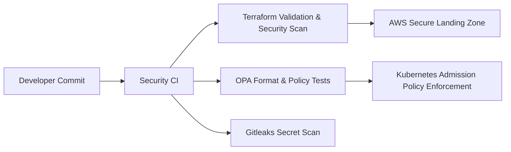

<div align="center">

# ☁️🔒Cloud Security Reference Architecture: IaC & PaC🔒☁️


[](https://github.com/careed23/-Cloud-Security-and-Infrastructure-as-Code-IaC-/actions/workflows/ci.yml)

<br>

**This repository contains a secure, production-ready baseline for cloud infrastructure, demonstrating the ability to define and enforce organizational security standards through code.**

</div>

---

## 📖 Table of Contents
* [Core Security Philosophy](#core-security-philosophy)
    * [1. Secure Reference Architecture (AWS Landing Zone)](#1-secure-reference-architecture-aws-landing-zone)
        * [Component Breakdown](#component-breakdown)
* [Security Rationale](#security-rationale)
    * [Networking (VPC & Subnets)](#networking-vpc--subnets)
    * [Centralized Auditing (CloudTrail/S3/CloudWatch)](#centralized-auditing-cloudtrails3cloudwatch)
    * [Least Privilege IAM](#least-privilege-iam)
    * [Policy as Code (OPA/Rego)](#policy-as-code-oparego)
* [Repository Layout](#repository-layout)
* [Quick Start](#quick-start)
* [Installation](#installation)
    * [Essential Tools](#1-essential-tools)
    * [Cloud Provider Access Configuration](#2-cloud-provider-access-configuration)
    * [Repository Preparation](#3-repository-preparation)
* [Usage Examples](#usage-examples)
    * [Security Policy Validation (PaC)](#1-security-policy-validation-policy-as-code---pac)
    * [Infrastructure Deployment (IaC)](#2-infrastructure-deployment-infrastructure-as-code---iac)
* [CI/CD Pipeline Integration](#cicd-pipeline-integration)
* [Contributing](#contributing)
* [License](#license)

---

## 💡 Core Security Philosophy

This architecture demonstrates a comprehensive approach to securing a cloud environment by enforcing security and compliance **proactively** at creation time (IaC) and **reactively** at deployment time (PaC). This dual-layered governance model ensures security is intrinsic, not external, to the development lifecycle.

### 1. Secure Reference Architecture (AWS Landing Zone)
The Terraform configuration defines a **Secure Landing Zone**—a non-negotiable, mandated baseline that all applications must inherit to ensure foundational security and compliance.

### Architecture at a Glance



#### Component Breakdown

| Layer | Primary Controls | Why It Matters |
| :--- | :--- | :--- |
| **Audit & Monitoring** | CloudTrail, CloudWatch Logs, centralized S3 audit bucket | Establishes immutable, centralized evidence for incident response and compliance. |
| **Networking** | Dedicated VPC, private subnets only, VPC flow logs | Eliminates public exposure for workloads and captures network telemetry. |
| **Identity** | Least-privilege IAM role + scoped policies | Minimizes blast radius by restricting permissions to the minimum necessary. |
| **Encryption** | Customer-managed KMS keys for audit/config data | Centralizes key control, rotation, and auditability. |
| **Continuous Compliance** | AWS Config recorder + managed rules | Detects drift and enforces baseline controls. |
| **Threat Detection** | GuardDuty detector | Flags suspicious activity across accounts and VPCs. |
| **Security Hub** | Centralized findings from GuardDuty, Config, etc. | Aggregates security findings for unified visibility. |
| **Data Classification** | Macie for sensitive data discovery | Identifies and protects sensitive data in S3. |
| **Access Analysis** | IAM Access Analyzer for unused permissions | Highlights over-permissive IAM policies. |
| **Compute Baseline** | Security group defaults, hardened IAM attachment | Enforces secure-by-default compute posture. |

---

## 🛡️ Security Rationale

### Networking (VPC & Subnets)
The use of **only private subnets** for compute resources ensures workloads are shielded from direct public exposure, prioritizing isolation and minimizing the attack surface (defense-in-depth).

### Centralized Auditing (CloudTrail/S3/CloudWatch)
All API activity is logged globally, encrypted, and stored in an immutable S3 bucket, streamed to CloudWatch for real-time monitoring and anomaly detection. This enforces non-repudiation.

### Encryption (KMS)
Audit and configuration data are encrypted with a customer-managed KMS key to enforce key ownership, rotation, and access boundaries.

### Continuous Compliance (AWS Config)
AWS Config records resource changes and evaluates managed rules such as public S3 access and password policy compliance.

### Threat Detection (GuardDuty)
GuardDuty is enabled to surface malicious or anomalous activity using threat intelligence and behavioral analytics.

### Security Hub
Security Hub aggregates findings from GuardDuty, Config, and other AWS services into a centralized dashboard, enabling automated remediation and compliance reporting.

### Data Classification (Macie)
Macie automatically discovers, classifies, and protects sensitive data in S3 buckets, helping prevent data breaches and ensure compliance with regulations like GDPR or PCI-DSS.

### Access Analysis (IAM Access Analyzer)
IAM Access Analyzer identifies unused IAM roles, policies, and permissions, reducing the attack surface by highlighting over-permissive access.

### Least Privilege IAM
The `SecureComputeRole` is defined with an explicit, minimal `compute_policy` granting only the permissions absolutely necessary for the application's function. This strictly enforces the **Principle of Least Privilege**, preventing lateral movement and minimizing blast radius.

### Policy as Code (OPA/Rego)
Admission-control checks prevent risky deployments (root containers, mutable image tags, privileged workloads) before they reach the cluster, ensuring compliance in the delivery pipeline.

---

## 🗂️ Repository Layout

| Path | Description |
| :--- | :--- |
| `aws_secure_landing_zone.tf` | Terraform reference architecture for AWS landing zone controls. |
| `k8s_opa_policy.rego` | OPA/Rego policies for Kubernetes admission control. |
| `k8s_opa_policy_test.rego` | Policy unit tests for OPA. |
| `examples/` | Example inputs for policy evaluation. |
| `versions.tf` | Terraform CLI and AWS provider version constraints + provider region configuration. |
| `backend.hcl.example` | Example remote-state backend configuration for secure Terraform state management. |
| `terraform.tfvars.example` | Starter variable values for fast local onboarding. |
| `Makefile` | Shortcut commands for Terraform, OPA, security checks, and planning. |
| `.github/workflows/ci.yml` | CI security gates for Terraform, OPA, and secret scanning. |
| `.pre-commit-config.yaml` | Local pre-commit checks mirroring CI quality and security gates. |

---

## ⚡ Quick Start

```bash
git clone [REPO_URL]
cd -Cloud-Security-and-Infrastructure-as-Code-IaC-
cp terraform.tfvars.example terraform.tfvars
pre-commit install
pre-commit run --all-files
make help
```

Optional (recommended for real environments):

```bash
cp backend.hcl.example backend.hcl
# edit backend.hcl values for your state bucket/table
terraform init -backend-config=backend.hcl
```

---

## 🛠️ Installation

This project requires essential command-line tools, cloud access configuration for AWS, and preparation of the local repository.

### 1. Essential Tools
Install the following tools on your local machine to manage the Infrastructure as Code (IaC) and Policy as Code (PaC) components.

| Tool | Purpose | Installation Guide |
| :--- | :--- | :--- |
| **Terraform** | IaC provisioning tool. | [Install Terraform](https://phoenixnap.com/kb/how-to-install-terraform) |
| **Open Policy Agent (OPA)** | Required for Rego policy validation. | [Install OPA](https://www.openpolicyagent.org/docs/latest/#getting-started) |
| **AWS CLI** | Required for AWS authentication and service interaction. | [Install AWS CLI](https://docs.aws.amazon.com/cli/latest/userguide/install-cliv2.html) |
| **pre-commit** | Local enforcement of formatting, linting, policy tests, and secret scanning. | [Install pre-commit](https://pre-commit.com/#installation) |

### 2. Cloud Provider Access Configuration
Terraform requires environment-specific credentials to deploy resources. We recommend using **IAM roles** or short-lived credentials.

#### A. Amazon Web Services (AWS) Setup
1. **Authenticate:** Run `aws configure` and enter your AWS credentials.
2. **Best Practice:** Utilize **IAM Roles** or **IAM User credentials** with the minimum necessary permissions.

### 3. Repository Preparation
1. **Clone the Repository:**
    ```bash
    git clone [REPO_URL]
    cd -Cloud-Security-and-Infrastructure-as-Code-IaC-
    ```
2. **Initialize Terraform:**
    ```bash
    terraform init
    ```
3. **Install Git Hooks:**
    ```bash
    pre-commit install
    ```
4. **Create Local Terraform Variables:**
    ```bash
    cp terraform.tfvars.example terraform.tfvars
    # edit terraform.tfvars for your project/environment
    ```

### 4. Terraform Variables and Safe Defaults

This repository now enforces safer input validation for critical variables:

- `project_name` naming constraints
- `vpc_cidr` CIDR format validation
- `audit_log_retention_days` minimum/maximum bounds
- `environment` allowlist (`dev`, `stage`, `prod`)

Example plan command with explicit region/environment:

```bash
terraform plan -var='aws_region=us-east-1' -var='environment=prod'
```

Example plan command using local variables file:

```bash
terraform plan -var-file=terraform.tfvars
```

### 5. Makefile Shortcuts

List available commands:

```bash
make help
```

Common commands:

```bash
make init
make security-checks
make plan
```

---

## 🚀 Usage Examples

### 1. Security Policy Validation (Policy as Code - PaC)
Validate your Kubernetes deployments against the security policies defined in `k8s_opa_policy.rego` using **Open Policy Agent (OPA)** before deployment.

| Step | Command | Description |
| :--- | :--- | :--- |
| **A. Test Policies** | `opa test . --verbose` | Runs all unit tests for Rego policies. |
| **B. Evaluate Example Input** | `opa eval -i examples/k8s-admission-request.json -d k8s_opa_policy.rego -q 'data.kubernetes.security.policy'` | Evaluates an admission request against policies. |

### 2. Infrastructure Deployment (Infrastructure as Code - IaC)
Manage the cloud resources using the standard Terraform workflow.

| Step | Command | Description |
| :--- | :--- | :--- |
| **A. Format & Validate** | `terraform fmt -check` | Ensures consistent formatting. |
| **B. Plan Deployment** | `terraform plan -out=tfplan` | Calculates and saves the execution plan for review. |
| **C. Apply Changes** | `terraform apply "tfplan"` | Executes the planned changes to provision resources. |
| **D. Destruction** | `terraform destroy` | Safely removes all provisioned resources (use with caution). |

---

## 🏗️ CI/CD Pipeline Integration

Integrating this architecture into a CI/CD pipeline ensures security checks (PaC) are mandatory before infrastructure changes (IaC) are applied, enforcing your compliance baseline on every commit.

### GitHub Actions Workflow
This repository includes a GitHub Actions workflow (`.github/workflows/ci.yml`) that runs automated checks on pushes and pull requests to the `main` branch.

#### Automated Checks
- **Terraform Format + Validate**: Ensures consistent formatting and valid Terraform syntax.
- **TFLint**: Detects Terraform misconfigurations and AWS best-practice issues.
- **Checkov**: Performs IaC security scanning on Terraform code.
- **OPA Format + Test**: Enforces Rego formatting and policy unit tests.
- **Gitleaks**: Scans for committed secrets.

### Local Security Gates (Recommended Before Push)

Run all configured local checks:

```bash
pre-commit run --all-files
```

Or run key checks manually:

```bash
terraform fmt -check -recursive
terraform init -backend=false
terraform validate -no-color
tflint --init && tflint --recursive
opa fmt --fail k8s_opa_policy.rego k8s_opa_policy_test.rego
opa test . --verbose
```

### Recommended Pipeline Gates
1. **Static checks:** `terraform fmt -check` and `terraform validate`.
2. **Policy checks:** `opa test . --verbose`.
3. **Plan review:** `terraform plan` gated by approvals.
4. **Apply:** only from protected branches.

---

## 🤝 Contributing
Contributions are welcome. Please review [`CONTRIBUTING.md`](CONTRIBUTING.md) before opening a pull request, and follow [`SECURITY.md`](SECURITY.md) for responsible vulnerability disclosure.

---

## 📄 License
Licensed under the MIT License. See `LICENSE` for details.
